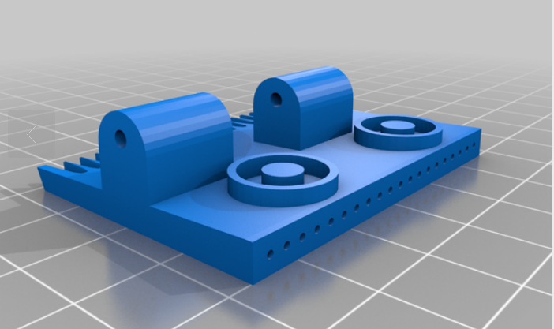
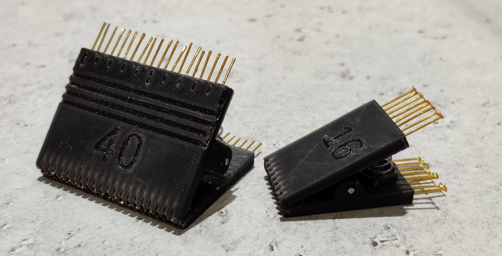

# Parametric DIP IC Test Clip.

This is heavily inspired by _https://www.thingiverse.com/thing:1104612_. I wanted to make some adjustments so re-approximated it using OpenSCAD.

Print 2 copies to make a single test clip.

You will also require;

* Metal pins to act as the clip contacts - I used 'Gold Brass Flat Headpins 50mm x 0.7mm Jewellery Making' from ebay.
* A hinge pin. I used 2mm silver steel that I had in my scrap box.
* Springs (1 or 2 depending on the length of the test clip). I made my own using 0.8mm 'music wire' and a lathe. You can probably buy springs - the length depends on the size of the clip.

I need to print with 0.1mm layer height to have enough accuracy for the clip pins to clear the holes.

So far, I have only printed the following versions (all other parameters left at default);

| STL                  |    ic_pin_count  |  ic_width  |
|---------------------|----------------------|--------------|
|dip_clip_16.stl   |   16                   |8               |
|dip_clip_40.stl   |   40                   |14             |

